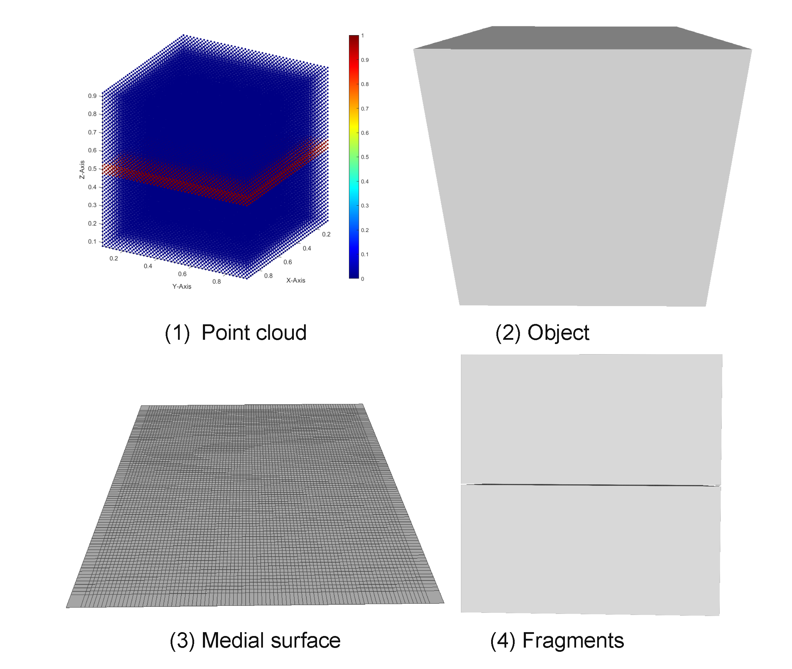
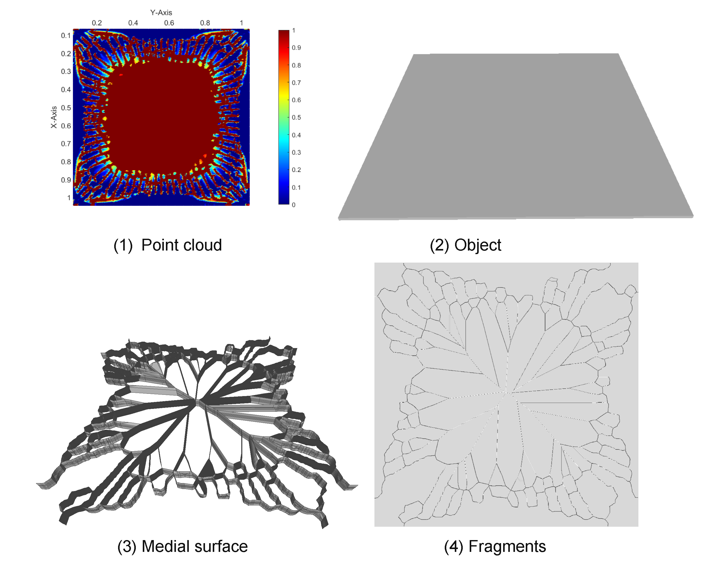

# What is this?

This respository contains the code for the paper "Simulating brittle fracture with material points". The code uses voronoi diagram to approximate a medial surface from damaged points cloud. Although the code is used to extract crack for brittle fracture, it could nevertheless be used to approximate the medial surface of any shape with a particle representation. The input points have their coordinates(x,y,z), and phase filed value(0-1) where 0 represents a healthy point and 1 is a fully damaged point. The output is a surface approximating the medial surface which could be: 1) the exact approximation, or 2) faces that only define a complete detached shape. The code also enables cutting with non-manifold mesh. The domain can be cut with level set([openVDB](https://github.com/AcademySoftwareFoundation/openvdb.git)) or direct mesh cutting([MCUT](https://github.com/cutdigital/mcut.git)). For more information, please refer to our paper.

# How to build?

* `git clone --recursive https://github.com/Linxu-Fan/crackExtraction.git`
* `git checkout master`
* `mkdir build && cd build`
* `cmake -DCMAKE_BUILD_TYPE=Release ..`
* build the code
    - If you are on Ubuntu 
        * run `make -j6 crackExtraction` 
    - else (Windows)
        * use visual studio

* build [fTetWild](https://github.com/wildmeshing/fTetWild.git) (this is required for direct mesh cutting approach)
    - copy the executable to the above build directory

# How to use?
* Write a text file and put the file into the build directory. Then pass the text file as the argument to the executable. The text file has 6 lines. See the demo file in the folder "[example](./example/glass/input.txt)".
    - the folder contains the object and point clouds file.
    - the point cloud file name. The file has four columns which are separated by space. The first three columns are the (x,y,z) coordinate and the last one is the phase value.
    - the object file name. It should be in .obj format.
    - the cutting method.
        * "OPENVDB_FULL": full cut with openVDB. No partial crack is enabled.
        * "OPENVDB_PARTIAL": partial cut with openVDB. Partial crack is enabled.
        * "MCUT": direct mesh cutting with MCUT.        
    - the medial surface resolution which should be roughly twice of the average point space.
    - the openVDB voxel size. The cutting gap is thinner with a small voxel size.

# Examples: 

* Mode 1 test 

* Glass(The algorithm is robust with excessive damage region.)

