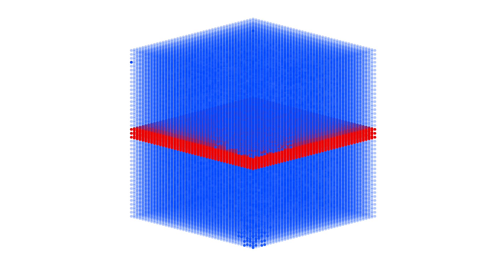
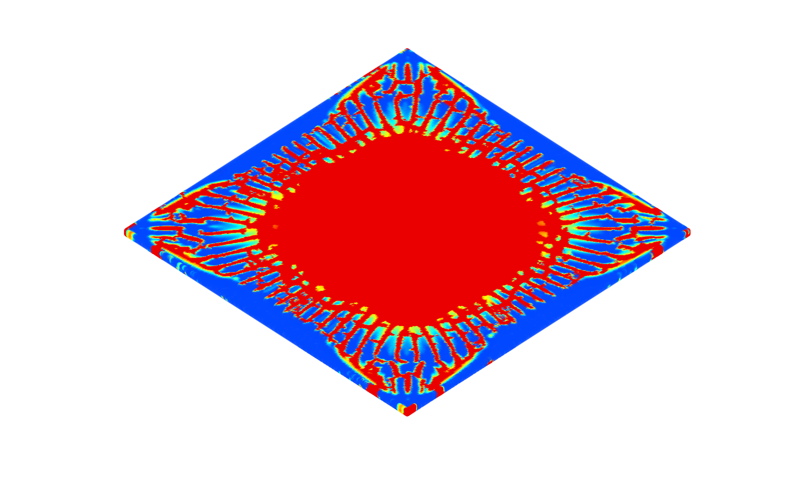

# Crack surface extraction

This respository provides an implementation of the crack extraction method that is described in the paper "Simulating brittle fracture with material points" (Sec.6). The extraction method uses a 3D voronoi tessellation to approximate each crack as a medial surface within a damaged material-particle region. 

The code may be used to compute one or more such medial surfaces that are inside of any 3D shape using samples of points inside its volume. Each such point (x, y, z) is associated with a 'damage' scalar value between 0.0 and 1.0, where the value 0.0 represents 'healthy', and 1.0 represents 'fully damaged'. 

In summary, the following outputs are computed by the code: 

1. Medial surface approximation(s) each damage region, and 
2. The faces defining a complete detached shape. 

The input 3D shape may be cut (to create fragments/disjoint parts) using one of two methods: 

1. Implicit surfaces using level-sets ([OpenVDB](https://github.com/AcademySoftwareFoundation/openvdb.git)), or 
2. Explicit surfaces using mesh intersections ([MCUT](https://github.com/cutdigital/mcut.git)). 

Refer to the paper for more information.

# Building the code

1. `git clone --recursive https://github.com/Linxu-Fan/crackExtraction.git`
2. `git checkout master`
3. `mkdir build && cd build`
4. `cmake -DCMAKE_BUILD_TYPE=Release ..`
5. Build the executable
    - If you are on Linux 
        * Run `make -j6 crackExtraction` 
    - else (e.g. Windows)
        * Open generated .sln file in [Visual Studio](https://visualstudio.microsoft.com/vs/older-downloads/)
6. Setup [fTetWild](https://github.com/wildmeshing/fTetWild.git) (For preprocessing meshes before cutting)
    - Clone 
    - Build (using instruction on project github page)
    - Copy executable into `build` directory above (Step 3).

# Running the code

Running the compiled executable requires a text file containing input parameters. For reference, the [glass example](./example/glass/) directory has the following text file:

```python
../example/glass # relative path to directory of files
particles.txt # file containing the material points
object.obj # 3D shape
OPENVDB_FULL # cutting method
0.0035 # medial surface resolution
0.00035 # OpenVDB voxel size ()
```

The point cloud file (e.g. `particles.txt`) has four columns separated by spaces. The first three columns are the (x,y,z) coordinates and the last columns is the damage value of the corresponding point. The 3D shape file should be a watertight triangle mesh in .obj format.
The choice of cutting method is specified using one of the following options.
- `OPENVDB_FULL`: Full cuts only i.e. partial cracks are disabled.
- `OPENVDB_PARTIAL`: With partial cuts i.e. partial crack are enabled, which means you will see partially propagated on the output fragment geometry.
- `MCUT`: Direct mesh cutting using MCUT (equivalent to `OPENVDB_FULL` but with meshes). 

The medial surface resolution should be roughly twice of the average point space. The OpenVDB voxel size is set relative to the dimensions of your 3D shape. The thickness of observable gaps on resulting fragments (assuming partial cuts are enabled) is dependent on this parameter.

# Examples of what this code does 

Three examples of crack extraction and cutting are shown below, which Mode-I, Mode-III, and a thin glass with execerbated damage. 

## Mode-I fracture

Input 3D shape


Damage



Crack


Overlay


Fragment


## Mode-III fracture

Input 3D shape


Damage


Crack


Overlay


Fragment


## Glass fracture

Input 3D shape


Damage



Crack


Overlay


Fragment


